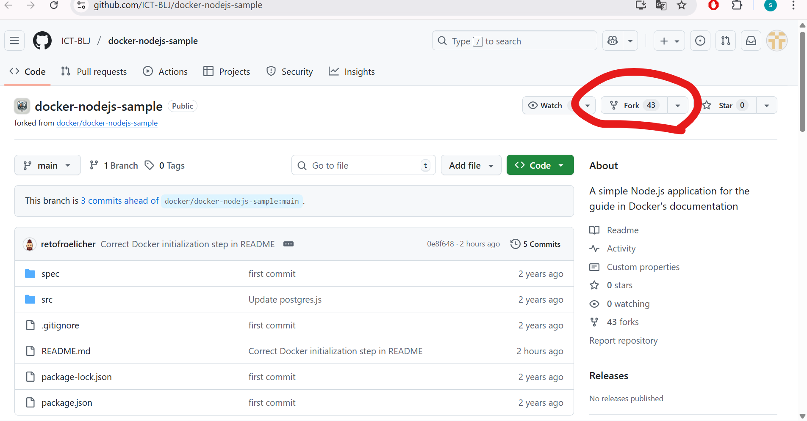

# **Thema:** Erstellen einer ToDo-Applikation mit Markdown, Git, GitHub und Docker

In dieser Abschlussaufgabe werden alle erlernten Fähigkeiten in den Bereichen **Markdown**, **Git**, **GitHub** und **Docker** kombiniert. Die Aufgabe besteht darin, eine ToDo-Applikation zu erstellen und diese in einem Docker-Container bereitzustellen.

## Klonen des Repositories


Von dort aus habe ich auf "Fork" geklickt, um eine Kopie des Repositories zu erstellen. Nachdem ich die Kopie erstellt hatte, habe ich auf "Code" geklickt und den Befehl unter HTTPS kopiert.
Danach habe ich PowerShell geöffnet, habe zum richtigen Verzeichnis gewechselt und den Befehl `git clone https://github.com/Z8o49/docker-nodejs-sample.git` ausgeführt, um das Repository zu klonen.

## Installation der notwendigen Pakete

Ich habe über den Link auf Moodle die Anweisungen für die Installation der notwendigen Pakete gelesen und die jeweiligen Commands um die Pakete zu installieren ausgeführt. Danach musste ich noch ein paar Fragen beantworten, die sich auf die Installation der Pakete beziehen. Schlussendlich habe ich noch kurz überpruft, ob alle Pakete installiert wurden.

## Docker-Konfiguration und -Installation

Über den Link auf Moodle bin ich auf die Seite von [Docker](https://www.docker.com/products/docker-desktop/) gekommen und musste dan dort die passende Download Option für Windows auswählen. Danach habe ich diese heruntergeladen und installiert. Bevor ich Docker verwenden konnte, musste ich noch WSL2 updaten und meinen Laptop neu starten. Mit dem Beispiel von Moodle habe ich dann überprüft ob Docker funktioniert und konnte es erfolgreich starten. Zum Schluss habe ich noch die [Visual Studio Code Extension für Docker](https://marketplace.visualstudio.com/items?itemName=ms-azuretools.vscode-docker) heruntergeladen.

## Starten der Applikation in einem Docker-Container

### Anwendung gestartet

Ich habe im Terminal in das Verzeichnis `docker-nodejs-sample` gewechselt und folgenden Befehl ausgeführt:

```bash
docker compose up --build
```

Anschließend habe ich meinen Browser geöffnet und folgende Adresse aufgerufen:
http://localhost:3000
Ich habe nun meine einfache ToDo-Applikation gesehen. Um die Anwendung zu stoppen, habe ich im Terminal `Strg + C` gedrückt.

### Anwendung im Hintergrund gestartet

Ich konnte die Anwendung auch im Hintergrund (detached mode) ausführen, indem ich die Option `-d` hinzugefügt habe. Dazu habe ich im Verzeichnis `docker-nodejs-sample` folgenden Befehl ausgeführt:

```bash
docker compose up --build -d
```

Anschließend habe ich meinen Browser geöffnet und die Adresse aufgerufen:
[http://localhost:3000](http://localhost:3000)
Die ToDo-Applikation lief nun im Hintergrund. Um sie zu stoppen, habe ich den folgenden Befehl genutzt:

```bash
docker compose down
```
